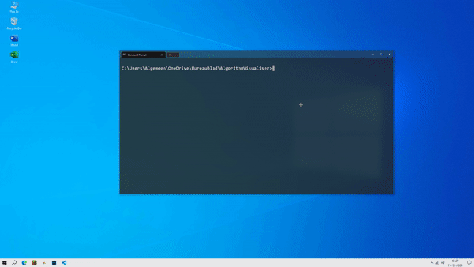

# Algorithm Visualiser - Python


A pretty cool program written in Python using PyGame, that loads in a CSV file filled with numbers and can visualise them, as well as visually sort them.

## Extra
There are some scripts provided to generate a dataset, for generating a [linear dataset](generate_linear.py), and a complete [randomized dataset](generate_dataset.py)

## Install
To install it is as simple as just cloning this repository by running
```sh
git clone https://github.com/DeanCash/AlgorithmVisualiser.git
```
And then run it by doing
```sh
cd AlgorithmVisualiser
python main.py
```
